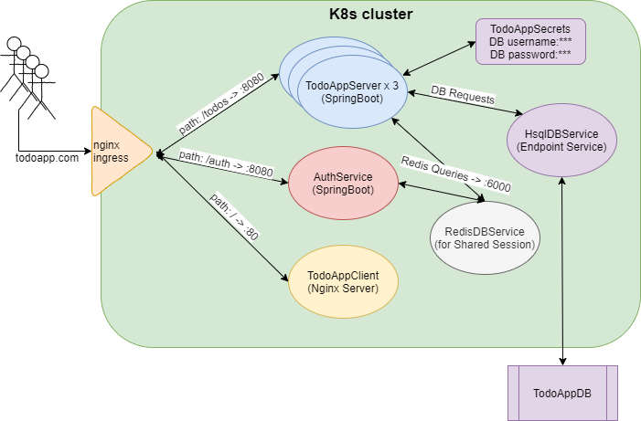

# ToDoApp
ToDoApp is developed to use for Proof of Concept works on scalable environments. 
It consists of a backend and a frontend projects. 
In development profile, backend and frontend applications can directly call each other.
On the other hand; in production profile, environment is implemented as a kubernetes cluster.

The system architecture is as follows:

Details can be found in subproject pages.

- [ToDoAppClient Project](./ToDoAppClient)
- [ToDoAppServer Project](./ToDoAppServer)
- [Other configuration files](./TodoAppConfig)
  - [todoappingress-k8s.yaml](./TodoAppConfig/todoappingress-k8s.yaml) creates nginx ingress for
  system routing. 
  - [todoappdb-k8s.yaml](./TodoAppConfig/todoappdb-k8s.yaml) creates an endpoint service which is used 
  as database proxy inside k8s cluster. (Database is located as a static resource outside of the cluster)
  - [todoappsecrets-k8s.yaml](./TodoAppConfig/todoappsecrets-k8s.yaml) creates a secret object which holds
  database username and password. (This object should be updated with real db username/password by using related
  kubectl commands)
  - [todoapp-db.sql](./TodoAppConfig/todoapp-db.sql) contains sql scripts to construct application initial database.